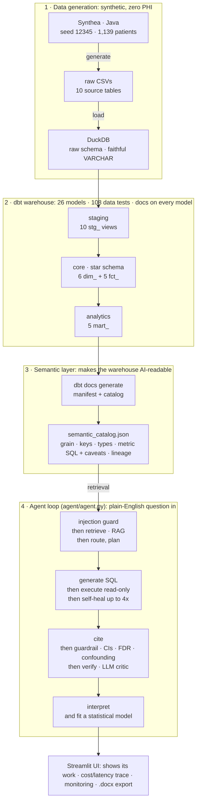
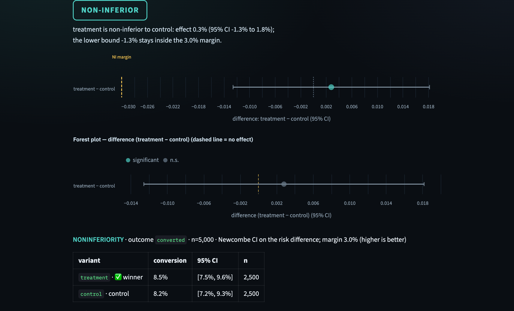
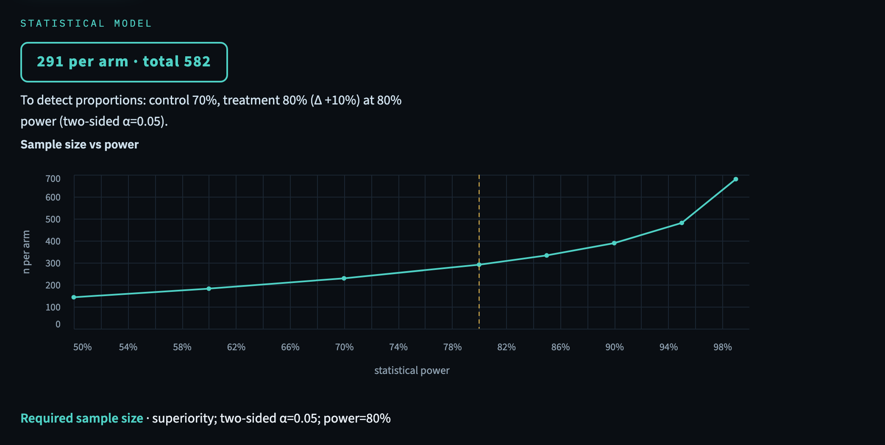

# Clinical Insight Agent: an AI data scientist over a dbt warehouse

[](https://github.com/Ediebah/clinical-insight-agent/actions/workflows/ci.yml)
[](LICENSE)
[](pyproject.toml)
[](https://clinical-insight-agent.streamlit.app)

An AI agent that runs end-to-end data science over a dbt-modeled healthcare warehouse. It is not a
text-to-SQL tool. You ask a question in plain English, and it pulls the right schema context, decides
which statistical model the question actually needs (survival, adjusted regression, causal,
non-inferiority, forecast, or a machine-learning model), prepares the data and checks the model's
assumptions, runs a deterministic statistical guardrail, reviews its own answer, and reports the result
with the caveats most tools leave out. Any analysis exports to a Word report.

What makes it useful is not the language model but the statistical judgment built around it: the data
preparation before a model is fit, the assumption diagnostics after, and a guardrail that computes
confidence intervals, corrects for multiple comparisons, and watches for confounding. A text-to-SQL tool
does none of that. I built it as a clinical data scientist working in biostatistics and ML.

Everything runs on synthetic EHR data, so there is no PHI and the whole project is public and reproducible.

Live demo: [clinical-insight-agent.streamlit.app](https://clinical-insight-agent.streamlit.app).
CI runs on every push: `dbt build`, 108 data tests, 288 unit tests, and the guardrail eval.


---

## Quickstart (about a minute)

The repo ships a slim demo warehouse (`data/healthcare_demo.duckdb`), so the app runs immediately:
no Java, no Synthea, no dbt build.

```bash
git clone https://github.com/Ediebah/clinical-insight-agent && cd clinical-insight-agent
uv venv --python 3.12 && uv pip install -r requirements.txt
cp agent/.env.example agent/.env       # add OPENAI_API_KEY, or run a free local model (see below)
.venv/bin/streamlit run app.py
```

The dashboard, lineage tracing, and monitoring/data-quality tabs work with no key at all. Asking the
agent questions needs `OPENAI_API_KEY` in `agent/.env`, or any OpenAI-compatible endpoint: with
[Ollama](https://ollama.com), `ollama pull llama3.1`, then set `OPENAI_BASE_URL=http://localhost:11434/v1`
and `OPENAI_MODEL=llama3.1` (no key, no cost, fully private). To regenerate the data and rebuild the
warehouse from scratch, see [Run it locally](#run-it-locally-full-rebuild).

---

## What it does

- Runs a full analysis from one question. It retrieves schema context, plans an approach, writes SQL, and
  fixes that SQL on its own when a query errors, returns nothing, or comes back all zeros. Then it cites the
  tables it used, runs the guardrail, reviews its own work, and interprets the result. The UI shows every
  step, along with the cost and latency of the run.
- Picks the model the question calls for and fits it with `statsmodels` or `scikit-learn`, so the numbers are
  computed rather than generated: regression, survival, causal effects, A/B ship-decisions, non-inferiority,
  forecasting, feature importance, and power or sample-size for study design. When you want the *best*
  predictor, it compares candidate models (logistic/linear, random forest, gradient boosting) by a
  cross-validated composite score and keeps the winner — so uploaded data gets the model that fits it,
  not a default.
- Applies the statistics a plain SQL tool skips: covariate adjustment, confidence intervals throughout, FDR
  correction for multiple comparisons, checks for confounding and Simpson's paradox, and model-assumption
  diagnostics.
- Evaluates a model beyond a single score: a **decision curve analysis** (net benefit vs treat-all/none,
  Vickers & Elkin 2006) for clinical utility, and a **failure analysis** (calibration by risk decile, the
  false-positive/negative split, and the subgroup it misclassifies most) — both on out-of-fold predictions.
- Understands conditions in plain English. Name a disease the way people say it (*heart attack*, *COPD*,
  *diabetes*, *MI*) and it maps the term to the SNOMED descriptions actually in the warehouse before it
  queries, so "heart attack" finds *Myocardial infarction*. It builds the cohort from what exists, and when a
  condition isn't in the data it says so instead of analyzing an empty set.
- Checks the data before reasoning over it. It can trace where any number comes from, following the dbt
  lineage from a mart back to the raw Synthea table. A pre-flight health check refuses to run when the
  warehouse is failing a critical integrity test, so a broken pipeline can't quietly feed corrupt metrics
  into an analysis.
- Built to run in production: the SQL engine is read-only, there is a live monitoring tab, an eval suite,
  288 unit tests in CI, a Dockerfile, upload-your-own-data, and a Word-report export.

---

## Validated on real public data

The demo runs on synthetic data, which has no ground truth to check the statistics against. So the
agent's own models are also run on real, already-analysed data and checked against the published
literature, across four of its methods — and, crucially, the agent's **model-selection engine**
compares candidate models and lands on each publication's own choice:

- **Logistic regression + random forest** — UCI Cleveland heart-disease data (Detrano et al., 1989):
  the logistic model recovers the settled coronary-artery-disease risk factors (diseased vessels OR
  3.07, male sex OR 3.92, asymptomatic chest pain as the highest-risk category, ST depression OR 1.70,
  max heart rate inverse), and the random forest reaches a cross-validated **AUC of 0.90**, inside the
  published 0.84–0.91 band.
- **Cox regression + Kaplan-Meier** — UCI Heart Failure Clinical Records (Chicco & Jurman, 2020): the
  Cox model recovers ejection fraction (**HR 0.95** per %) and serum creatinine (**HR 1.36**) as the
  headline mortality predictors — the same two the paper singles out — and the survival curves separate
  reduced- from preserved-ejection-fraction patients.
- **Bayesian interim go/no-go** — the published worked example of Chen & Chen (2019): at an 8/25
  interim look the agent's `fit_interim` returns a predictive probability of success of **0.105**, the
  value the paper reports.
- **Machine learning (random forest)** — Wisconsin Diagnostic Breast Cancer (Wolberg et al., 1995): the
  agent's random forest reaches a cross-validated **AUC of 0.99**, inside the reported benchmark band,
  with the settled tumour markers (size, concavity) on top.
- **Survival ML (random survival forest)** — UCI Heart Failure Records: a tuned random survival forest
  (scikit-survival) is compared against a tuned Cox model by a **survival composite** (Harrell's C-index,
  time-dependent AUC, and Brier skill). The forest wins (**C-index 0.75**) and recovers serum creatinine
  and ejection fraction, the same predictors as the Cox model.
- **Model selection** — the agent doesn't hard-code a model. `compare_models` cross-validates logistic
  (or linear), random forest, and gradient boosting by a **composite score** (mean of ROC-AUC, PR-AUC,
  and balanced accuracy) and keeps the winner. On the three datasets above it lands on each publication's
  own choice — logistic for heart disease, and the **random forest for heart failure**, exactly as
  Chicco & Jurman (2020) found. So an uploaded dataset gets the model that fits *it*, not a default.

It is the same `agent/modeling.py` code the app runs, and every reproduction is **CI-enforced**
(`tests/test_validation.py`), so a change that quietly breaks the modeling is caught against real
ground truth. Details and runnable scripts: [`examples/`](examples/).

---

## Architecture

The whole pipeline is versioned, tested, and public. Synthetic data feeds a governed dbt star schema; a
semantic layer makes that schema readable to the agent; the agent runs a self-checking analysis loop; and
the UI shows the result. Nothing you type reaches SQL, and the query engine is read-only.



---

## Capabilities

### The agent loop  (`agent/agent.py`)
A question first passes a prompt-injection check, then RAG retrieval pulls the relevant slice of the semantic
catalog. The agent decides whether the question needs an inferential model or just an aggregation, and asks a
clarifying question when a request is too vague to answer. It forms a hypothesis and a plan, writes DuckDB
SQL, and runs it read-only. If the query errors, returns nothing, or degenerates to all zeros, it rewrites
and retries up to four times. It then cites the catalog tables it used, runs the statistical guardrail, and
has a second LLM critic confirm that the SQL actually answers the question asked before interpreting the
result and giving a recommendation. A per-run time budget and graceful fallbacks keep it from hanging or
crashing the app, and every run's tokens, latency, and cost are recorded.

### Condition-specific analysis  (`agent/vocabulary.py`)
Ask about a specific disease in plain English and a deterministic resolver maps the term to the SNOMED
`condition_description` values in the warehouse before any SQL runs. "Heart attack" becomes *Myocardial
infarction*; *COPD* becomes both *chronic obstructive bronchitis* and *pulmonary emphysema*; common
abbreviations (MI, HTN, CKD, IHD) and forms like *diabetics* or *asthmatics* resolve too. Both the aggregate
and the modeling paths then filter on a cohort that exists, so the agent never fits a model on an empty set.
A condition that isn't in this synthetic build, such as *flu*, returns an honest note naming the closest
available conditions, and a tiny cohort, such as *stroke* at n=6, is reported as too small to model rather
than forced. It needs no API key, and no user text reaches SQL: matching happens over an in-memory copy of
the vocabulary, so there is nothing to inject into. It held up across a roughly 2,250-scenario adversarial
stress test with no crashes, false blocks, or invalid filters, and whole-word matching brought precision on
ordinary analytical questions to 100%.

### Data trust: lineage and a pre-flight health gate  (`agent/lineage.py`, `agent/quality_agent.py`)
Two checks keep the agent on data it can trust.
- Lineage. A "where does this number come from?" question is answered straight from the dbt DAG, with no LLM
  and no SQL: the readmission rate traces back as `mart_readmissions ← fct_encounters ← stg_encounters ← raw
  synthea.encounters`, and "what depends on fct_encounters?" walks the graph the other way. The lineage is
  baked into the semantic catalog at build time, so it works on the deployed app even with no manifest
  present, and every analysis attaches the provenance of the tables its SQL touched.
- Pre-flight health gate. Before it produces any metric, a cached data-quality battery runs against the
  warehouse: primary-key uniqueness, referential integrity, completeness, accepted values, and numeric
  ranges. A critical failure, such as a duplicate key or an orphaned foreign key, blocks the analysis rather
  than letting a broken pipeline push corrupt numbers downstream. It stays quiet when the data is healthy and
  speaks up when it isn't.

### Model families it fits  (`agent/modeling.py`)
| Question shape | Model | Output |
|---|---|---|
| Adjusted risk or effect (binary) | Logistic regression | Adjusted odds ratios with 95% CIs |
| Adjusted effect (continuous) | OLS regression | Adjusted coefficients with 95% CIs |
| Time-to-event / survival | Cox PH and Kaplan-Meier | Hazard ratios and KM curves with CI bands |
| Strongest predictors | Random forest importance | Permutation importance, leakage-safe CV |
| Forecast / trend | Holt-Winters | Forecast with a widening band over the horizon |
| Effect of an intervention | Cross-fitted AIPW (doubly robust) | ATE with an influence-function CI, positivity trimming |
| "Should we ship variant B?" | A/B experiment | Ship / no-ship / inconclusive with a lift CI, BH-FDR |
| "Is treatment non-inferior?" | Non-inferiority | Farrington-Manning test with a Miettinen-Nurminen CI |
| "How many patients per arm?" | Power / sample-size | n per arm and a sample-size vs power curve |
| "Should we invest in Phase II?" | Bayesian assurance (single-arm, design-stage) | GO / CONSIDER / STOP with the probability of success, prior sensitivity, and operating characteristics |
| "Is a controlled trial worth running?" | Bayesian assurance (two-arm, design-stage) | Probability a randomized trial ends in GO, deciding on the risk difference against a known control rate, with the assurance-vs-n planning curve |
| "Stop this trial for futility?" | Bayesian interim (single-arm) | Predictive probability of success, posterior with a credible interval, pre-specification status |
| "Continue the drug vs control at interim?" | Bayesian interim (two-arm) | GO / CONSIDER / STOP on the risk difference, per-arm posteriors, exact predictive probability of success |
| Two-variable association | Pearson / Welch t / ANOVA / χ² | Test statistic and p-value |

Before any model is fit, the data goes through a preparation pass (`_prepare`). Rows missing the outcome are
dropped, predictors more than 10% missing are dropped, and quasi-constant, datetime, high-cardinality, and
ID-like columns are removed. Sparse categorical levels are pooled into an `other` bucket to avoid separation,
the rest is single-imputed with a median or mode, and collinear predictors are removed by VIF. After fitting,
the model surfaces assumption problems rather than quietly fixing them: events-per-variable, complete or
quasi-complete separation, proportional hazards (Schoenfeld residuals), non-linearity (a quadratic-term
test), and heteroskedasticity (Breusch-Pagan). The random forest is trained inside a `scikit-learn` Pipeline
with imputation fit per fold to avoid leakage, 5-fold cross-validation, and class balancing.

For an adjusted model it then runs a specification-curve check: it refits the headline effect across a
defensible covariate multiverse (unadjusted, fully adjusted, and each leave-one-covariate-out) and reports
whether the result keeps its sign and significance across all of them, or is fragile to a single covariate
choice. This is a direct, deterministic answer to the garden-of-forking-paths problem, where the same data
analyzed a few reasonable ways can reach different conclusions, and a fragile headline is flagged as a
caveat rather than presented as a stable finding.

### Bayesian go/no-go for trials  (`agent/bayes.py`, `agent/prespec.py`)
A separate decision module answers the two questions a drug or device programme actually asks: at design
stage, "given what we believe about the effect, what is the probability this trial ends in a GO?"
(*assurance*, i.e. Bayesian power, which averages over the prior instead of betting the whole answer on one
assumed effect size), and at an interim look, "given the patients seen so far, will it end in a GO if it runs
to full enrolment?" (the *predictive probability of success*, the signal that stops a trial for futility and
saves the money). The interim handles both a **single-arm** trial (a response rate against a fixed goal) and
a **randomized two-arm** trial (treatment vs a concurrent control), deciding on the **risk difference** with
an exact predictive probability computed by a joint beta-binomial enumeration over both arms' remaining
patients — the standard controlled-trial shape, grounded in the published go/no-go literature (Lee & Liu
2008; BOP2-DC / Zhao et al. 2023). Assurance mirrors the same two framings, so a **controlled trial can be
both planned and monitored**: the two-arm assurance gives the probability a randomized trial ends in GO
before it runs (a treatment prior against a known control rate, with an assurance-vs-n curve for choosing the
enrolment), and the two-arm interim then watches it mid-flight. Both use a **dual-criterion** rule (a Target
Value you hope for and a Lower Reference Value that is the minimum worth pursuing), so a device performance
goal is just the degenerate case where the two coincide. Everything is conjugate Beta-Binomial and computed in **closed form** — no Monte Carlo, so a
decision tool never returns a different verdict on re-run. Two guardrails come with it: a **prior-sensitivity
panel** that reports how the probability of success varies across a vague, a skeptical, and an enthusiastic
prior (FDA's Jan-2026 draft-guidance requirement), with the design flagged **under-powered** when its power
at the Target Value falls below the conventional 80% — the operating characteristic that actually measures
whether the trial can detect the effect — and a **pre-specification lock** hashes the prior,
thresholds, and planned n at design stage so an interim run can be stamped PRE-SPECIFIED, DRIFTED (naming
every field that moved), or EXPLORATORY. The lock is honest about its own limits: a content hash proves
integrity, not anteriority, so it points you at a protocol or registry entry for that. This is decision
support, not a regulatory-submission tool, and it says so.

### The statistical guardrail  (`agent/guardrails.py`), deterministic, no LLM
Computed in code rather than by the model: Wilson score intervals per group; pairwise Newcombe difference
intervals with two-proportion z-tests, corrected for multiplicity with Benjamini-Hochberg FDR; skew-aware
summaries (median and IQR plus a bootstrap mean interval); detection of confounding and Simpson's paradox;
and flags for a missing denominator or too many comparisons. A note that the data is synthetic is always
present. The LLM is allowed to phrase these caveats but never to invent or drop one.

### Security: read-only, hardened at the engine  (`agent/warehouse.py`)
The DuckDB connection is opened read-only, with external access disabled and no extension autoloading, so the
engine itself rejects every write and every attempt to reach the filesystem or a URL (`COPY … TO`,
`read_csv`, `read_text`, `read_blob`, `glob`, `ATTACH`, `httpfs`). On top of that there is a statement
denylist for write and DDL keywords and file-reading table functions, single-statement enforcement, an outer
row cap, and an append-only audit log. Read-only on its own would not stop file exfiltration; this setup
does, and it is covered by tests.

### Monitoring tab  (`app.py`)
A small ops surface for the agent: usage, success rate, latency at p50 and p95, tokens, and estimated spend,
plus an activity chart and the most-asked questions. Users can leave thumbs-up or thumbs-down feedback with a
free-text correction. It also runs live data-quality checks against the warehouse, covering row volumes,
primary-key uniqueness, referential integrity, completeness, and metric sanity (for example, whether the
readmission rate sits in a plausible band).

### Word report export  (`agent/report.py`)
Any analysis exports to a Statistical Analysis Report in the format the industry uses: a title and approval
page marked DRAFT with a signature block, a synopsis, the data sources and analysis population, methods that
record the exact software versions used at runtime, numbered results tables (with mutually exclusive N and
events per category and the reference level called out), forest, Kaplan-Meier, forecast, and power figures,
the assumption diagnostics, the guardrail findings, an interpretation, and an ICH-E9 limitations and
validation statement, with a confidential, page-numbered footer. It is rendered and checked in a real Word
engine (`python-docx` with `vl-convert`).

### Bring your own data  (`agent/userdata.py`)
Upload a CSV or Excel file and the same agent runs on it. The table is registered in a session-scoped DuckDB,
a semantic catalog is generated from its columns, and the full pipeline (SQL, guardrail, and any model,
including A/B and non-inferiority) answers questions about your data. A notice reminds you to upload
non-sensitive data only, since column names and a few example values are sent to the LLM.

### Automation
- Automated dbt model generation (`agent/model_builder.py`): from plain English, the agent drafts a dbt model
  that refs the star schema along with its schema tests, writes the `.sql` and `schema.yml`, runs `dbt build`,
  and self-heals by reading the failure, rewriting, and rebuilding until the build is green.
- Data-quality auto-fix demo (`agent/pipeline_healer.py`): when a dbt test fails, the agent diagnoses the root
  cause, proposes a fix, and rebuilds to green.

### The warehouse  (`warehouse/`)
`dbt-core` with `dbt-duckdb` and `dbt_utils`, 26 models across staging, a core star schema, and analytics
marts, with 108 data tests and docs on every model. [Synthea](https://github.com/synthetichealth/synthea)
generates 1,139 synthetic patients reproducibly (seed 12345). A semantic catalog covering 16 modeled tables
and 6 named metrics with their statistical caveats is generated from the dbt artifacts to make the warehouse
readable to the agent, and a deterministic token-overlap RAG retrieves over it with no embedding calls.

### Engineering
- 288 keyless `pytest` unit tests covering the guardrail statistics, SQL validation and security, retrieval,
  charts, agent helpers, modeling, condition-vocabulary grounding, data lineage, and the data-quality gate,
  plus `ruff` and a coverage gate, all run in CI.
- GitHub Actions CI on every push: Synthea, then DuckDB, then `dbt build` (108 tests), then a catalog
  regenerate, then the guardrail eval.
- An eval suite over a 35-case labeled `GOLD` set: answer accuracy, retrieval precision/recall/MRR (keyless),
  guardrail precision/recall (keyless and deterministic), and an LLM-as-a-judge check for factual consistency
  (hallucination rate) and relevance.
- Deployable with a `Dockerfile` (portable to Cloud Run, Render, Railway, or Fly) and `DEPLOY.md`, or on
  Streamlit Community Cloud. The OpenAI key is a runtime secret and is never baked in.






---

## Run it locally (full rebuild)

The [Quickstart](#quickstart-about-a-minute) above runs on the committed demo warehouse. This path
regenerates everything from scratch: synthetic patients, the raw load, the full dbt build, and the
semantic catalog. Prereqs: `git`, [`uv`](https://docs.astral.sh/uv/), a JDK 17+ (only needed to
regenerate data), and an OpenAI key (or a local model, see below).

```bash
# 1. Environment (dev = app + dbt; the deployed app installs only requirements.txt)
uv venv --python 3.12 && uv pip install -r requirements-dev.txt

# 2. Generate data → load → build + test the warehouse
cd synthea && java -jar synthea-with-dependencies.jar \
  --exporter.csv.export true --exporter.fhir.export false -p 1000 -s 12345 -cs 12345 Massachusetts && cd ..
.venv/bin/python scripts/load_raw.py
cd warehouse && ../.venv/bin/dbt build --profiles-dir . && ../.venv/bin/dbt docs generate --profiles-dir . && cd ..

# 3. Build the semantic catalog + add your key
.venv/bin/python agent/build_catalog.py
cp agent/.env.example agent/.env      # then put your OPENAI_API_KEY in agent/.env

# 4. Run the agent (CLI) + the checks
.venv/bin/python -m agent.agent "Which conditions are most prevalent in patients 75 and older?"
.venv/bin/python -m agent.agent "How does survival differ for heart attack patients?"   # → Myocardial infarction cohort
.venv/bin/pytest                           # 288 keyless unit tests   (ruff check . to lint)
.venv/bin/python -m agent.guardrail_eval   # guardrail precision/recall (no key)
.venv/bin/python -m agent.eval_retrieval   # retrieval precision/recall/MRR (no key)
.venv/bin/python -m agent.eval             # answer accuracy (needs a key)
.venv/bin/python -m agent.eval_judge       # LLM-as-judge: factual consistency + relevance
.venv/bin/python -m agent.observe          # observability: runs, error rate, latency p50/p95, spend
.venv/bin/python -m agent.model_builder    # autogen a dbt model + tests → build → self-heal
.venv/bin/python -m agent.pipeline_healer  # self-healing demo: dbt test fails → agent fixes → green

# 5. Run the app (Analyze + Monitoring tabs)
.venv/bin/streamlit run app.py
```

Run it free, on a local model: the agent talks to any OpenAI-compatible endpoint, so you can run it with
no OpenAI key and no cost. With [Ollama](https://ollama.com), run `ollama pull llama3.1`, then in
`agent/.env` set `OPENAI_BASE_URL=http://localhost:11434/v1` and `OPENAI_MODEL=llama3.1` and leave the key
blank. The deterministic half (dbt build, the data tests, the guardrail and retrieval evals) never needed
a key; this makes the agent loop keyless too. A small local model is weaker at generating SQL than
`gpt-4o`, so expect lower answer quality in exchange for zero cost and full privacy.

Deploy: the repo ships a slim `data/healthcare_demo.duckdb` (about 34 MB, the full star schema with
`fct_observations` sampled) so the app runs without rebuilding the warehouse. Build the container
(`docker build -t clinical-agent .`) and run it anywhere, or point a new app at `app.py` on
[share.streamlit.io](https://share.streamlit.io) and add `OPENAI_API_KEY` under Secrets. See `DEPLOY.md`.

---

## Stack

Python 3.12, DuckDB, dbt-core with dbt-duckdb and dbt_utils, statsmodels, scikit-learn, scipy, pandas and
numpy, Altair (with vl-convert for print figures), python-docx, Streamlit, and OpenAI (`gpt-4o` by default,
overridable with `OPENAI_MODEL`). CI runs on GitHub Actions; the app is packaged with Docker.

---

## Repo layout

```
├── app.py                       Streamlit UI, Analyze + Monitoring tabs
├── agent/
│   ├── agent.py                 the self-healing agent loop
│   ├── modeling.py              inferential models (regression, survival, AIPW causal, A/B, NI, power)
│   ├── guardrails.py            deterministic statistical guardrail (Wilson/Newcombe, FDR, confounding, …)
│   ├── warehouse.py             read-only, engine-hardened, audited SQL execution
│   ├── retrieval.py             token-overlap RAG over the semantic catalog
│   ├── report.py                Word Statistical Analysis Report export
│   ├── userdata.py              bring-your-own-data (CSV/Excel → same agent)
│   ├── model_builder.py         autogen + validate a dbt model from plain English
│   ├── pipeline_healer.py       self-healing pipeline demo (dbt test fails → agent fixes)
│   ├── charts.py, llm.py, observe.py, build_catalog.py
│   └── eval*.py, guardrail_eval.py, eval_dataset.py   the eval suite + GOLD set
├── warehouse/                   the dbt project (staging → core → analytics marts + tests + docs)
├── tests/                       288 keyless pytest unit tests
├── scripts/load_raw.py          Synthea CSV → DuckDB raw
├── .github/workflows/ci.yml     Synthea → DuckDB → dbt build → catalog → guardrail eval
├── Dockerfile, DEPLOY.md
└── data/healthcare_demo.duckdb  slim marts DB for the deployed demo (committed)
```

---

## Roadmap

- FHIR ingestion alongside the CSV path, so standard-format (still synthetic) bundles flow through the
  same star schema
- More model families: mixed-effects/GEE for repeated measures, competing-risks survival
- OpenTelemetry traces for the agent loop (today: JSONL logs plus the monitoring tab)
- A tested Postgres/Snowflake warehouse target (the models are currently DuckDB-dialect)
- Versioned releases, with the demo warehouse published as a release asset to keep clones slim

Issues and PRs are welcome; see [CONTRIBUTING](.github/CONTRIBUTING.md). Look for `good first issue`
labels if you want an on-ramp.

---

## Limitations

- Synthetic data. Synthea is structurally realistic but comes from care-process models, so the magnitudes are
  illustrative rather than empirical. This shows method, not clinical fact.
- Exploratory, not confirmatory. Variable selection is data-driven, and the CIs and p-values are not adjusted
  for that selection. A real regulatory analysis also needs a pre-specified SAP and independent
  double-programming, owned by a qualified biostatistician. The Word export says so.
- The deployed demo DB samples `fct_observations` to fit the repo size limit. No demo or eval question
  depends on it, and the full local warehouse has everything.
- The agent is grounded to the catalog and read-only, but it can still write a valid query that answers a
  slightly different question than you meant. That is why the SQL, the guardrail, and the verify step are all
  shown, to keep a human in the loop.
